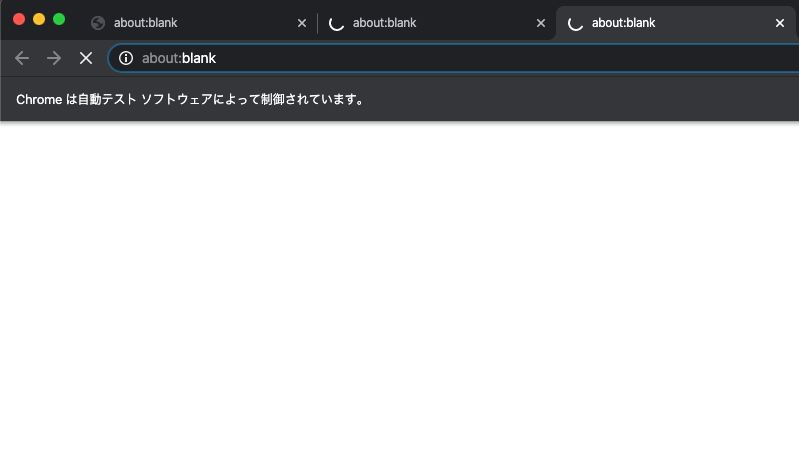

# Reloader (Chromium)

アクセス制限のかかった対象ページに繋がるまで   
自動でアクセスするpuppeteerスクリプト



# Use case

- 某チケットサイトの人気一般チケットを取る
- etc...

# Usage

```bash
$ yarn
$ node index.js -u 'http://example.org' -t 10000
```

# Notes

- IP制限かかったり、鯖落ちの原因になるかもなので、timeoutを短くしすぎるのはよくない
